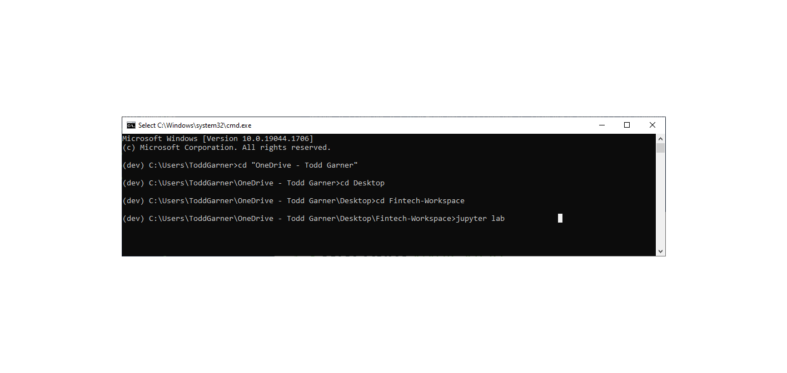
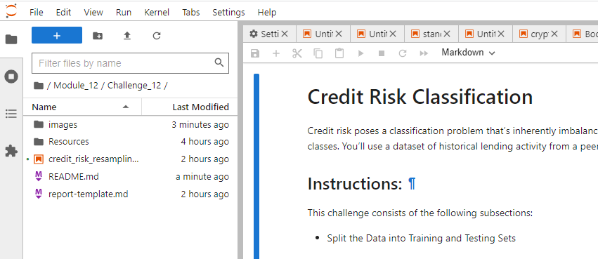
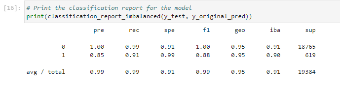
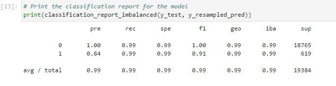

# Challenge 12 - Credit Risk Resampling
The purpose of this effort is to build a methodology that will predict the occurence of a much smaller set of data as compared to the overall data set, accurately.  In this case, we have a series of loans that only 3.25% are classified as risky.  We endeavor to create a methodology by which we can accurately identify risky loans even though the amount of those loans is small.  

We will be using oversampling and logistic regression combined versus only using logistic regression in our analysis.  Oversampling is a means to match the non-critical data with critical data so that they can be analilyzed accurately.  There are other ways to accomplish this but we are only evaluating oversampling in this analysis at this time.  We could use undersampling of the non-risky loans to match the data sets as well as combining the under and over sampling methods.    

We will approach both methods methodically in the following manner:

Instructions

This section divides the instructions for this Challenge into four steps and an optional fifth step, as follows:

## Split the Data into Training and Testing Sets
Open the starter code notebook and then use it to complete the following steps.

1. *Read the lending_data.csv data from the Resources folder into a Pandas DataFrame.*

2. *Create the labels set (y) from the “loan_status” column, and then create the features (X) DataFrame from the remaining columns.*

    *Note:  A value of 0 in the “loan_status” column means that the loan is healthy. A value of 1 means that the loan has a high risk of defaulting.*

3. *Check the balance of the labels variable (y) by using the value_counts function.*

4. *Split the data into training and testing datasets by using train_test_split.*

## Create a Logistic Regression Model with the Original Data
Employ your knowledge of logistic regression to complete the following steps:

1. *Fit a logistic regression model by using the training data (X_train and y_train).*

2. *Save the predictions on the testing data labels by using the testing feature data (X_test) and the fitted model.*

3. *Evaluate the model’s performance by doing the following:

        A. Calculate the accuracy score of the model.

        B. Generate a confusion matrix.

        C. Print the classification report.

4. *Answer the following question: How well does the logistic regression model predict both the 0 (healthy loan) and 1 (high-risk loan) labels?*

## Predict a Logistic Regression Model with Resampled Training Data
Now, we will employ resampling to our data.  Perhaps, a model that uses resampled data will perform better. We’ll resample the training data and then reevaluate the model. Specifically, we'll use RandomOverSampler.

To do so, complete the following steps:

1. *Use the RandomOverSampler module from the imbalanced-learn library to resample the data. Be sure to confirm that the labels have an equal number of data points.*

2. *Use the LogisticRegression classifier and the resampled data to fit the model and make predictions.*

3. *Evaluate the model’s performance by doing the following:*

        A. Calculate the accuracy score of the model.

        B. Generate a confusion matrix.

        C. Print the classification report.

The report-template.md is included in the repository and answers many of these questions.  

## Technologies

Describe the technologies required to use your project such as programming languages, libraries, frameworks, and operating systems. Be sure to include the specific versions of any critical dependencies that you have used in the stable version of your project.

This project was completed almost entirely in Jupyter Notebook.  The README.md was drafted in VS Code.  

There were several main libraries used in this project:
import numpy as np
import pandas as pd
from pathlib import Path
from sklearn.metrics import balanced_accuracy_score
from sklearn.metrics import confusion_matrix
from imblearn.metrics import classification_report_imbalanced

import warnings
warnings.filterwarnings('ignore')

More information can be found regarding each of these libraries at the following links:

numpy - https://numpy.org/

pandas - https://pandas.pydata.org/

Path from pathlib - https://docs.python.org/3/library/pathlib.html

balanced_accuracy_score from sklearn.metrics - https://scikit-learn.org/stable/modules/model_evaluation.html

confusion matrix from sklearn.metrics - https://scikit-learn.org/stable/modules/generated/sklearn.metrics.confusion_matrix.html

classification_report_imbalanced from imblearn.metrics - https://imbalanced-learn.org/dev/references/generated/imblearn.metrics.classification_report_imbalanced.html

This program was written and will run on Windows 10.  

---

## Installation Guide

In this section, you should include detailed installation notes containing code blocks and screenshots.

From the Command Line in Git Bash, navigate your directory to the location of the file package.  Then, type "Jupyter Notebook" to launch the application used to write and run this program.  It's outside of the scope of this README.md file to explain the installation of Jupyter Notebook.  A screenshot of the Command Line in Anaconda is shown here:  

From the Jupyter Notebook that was launched in the step above, navigate to the directory where the program is found and click on the program: "credit_risk_resampling.ipynb" as shown here in Jupyter Notebook:  

---

## Usage

This section should include screenshots, code blocks, or animations explaining how to use your project.

As it was explained in the preamble, the goal of this kind of analysis is to:

1. *Model*

2. *Fit*

3. *Predict*

4. *We will introduce a new part of the procedure when we add "Evaluate" to the process.*

Below, we'll show the classification output performing the evaluation on the LogisticRegression function only.  

    

We recomplete our analysis but also include resampling.  Below, you'll see the results of the evaluation of the LogisticRegression function and the resampling methodology combined.  

The Combined process yielded the most accurate results.  With a precision of 84% and a recall of 99%, this methodology appears to be accurate enough to discover the risky loans in our portolio despite being a much smaller percentage of the total, approximately 3.25%.  

---

## Contributors

This was done solely by Christopher Todd Garner

---

## License

Feel free to use this program and happy hunting for arbitrage profits.  Add some for loops or the like and optimal profits can be achieved.  
